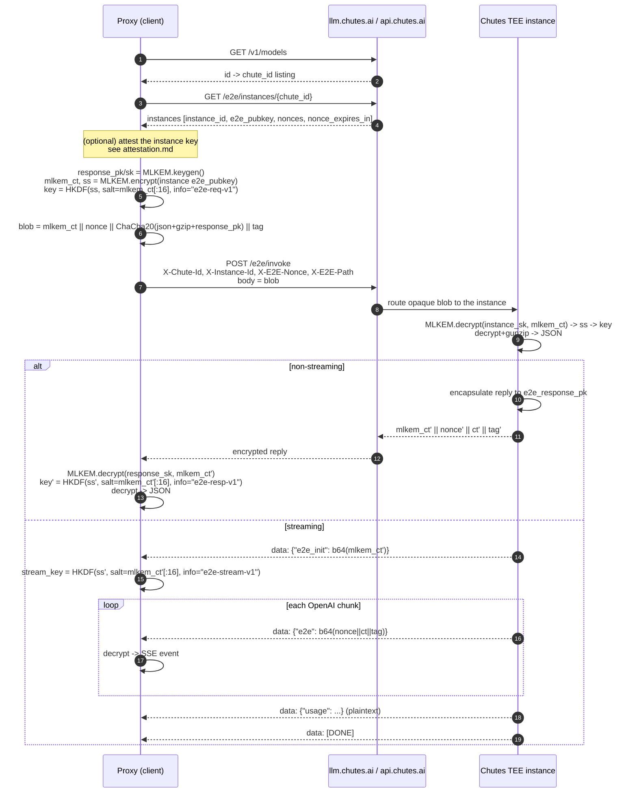

# End-to-end encryption

This document explains the cryptography that protects a prompt and its
completion between this proxy and a Chutes TEE instance. The implementation is
in the vendored `chutes-e2ee` transport
(`chutes-e2ee-transport/src/chutes_e2ee/`), with the request/reply glue in
`src/chutes_litellm/`.

- [1. Threat model](#1-threat-model)
- [2. Primitives](#2-primitives)
- [3. Request key establishment](#3-request-key-establishment)
- [4. The reply](#4-the-reply)
- [5. Streaming](#5-streaming)
- [6. Freshness, nonces and replay](#6-freshness-nonces-and-replay)
- [7. Sequence diagram](#7-sequence-diagram)
- [8. What each layer guarantees](#8-what-each-layer-guarantees)
- [9. Code map and capture proof](#9-code-map-and-capture-proof)

---

## 1. Threat model

**Assets.** The confidentiality and integrity of the prompt and the completion,
in transit and while processed by the remote instance.

**Adversaries considered.**

| Adversary | Covered? | Why |
| --------- | -------- | --- |
| Passive network observer / ISP | ✅ | Payload is ChaCha20-Poly1305 ciphertext. |
| Chutes relay / control plane | ✅ | It routes `/e2e/invoke`; it never holds the instance ML-KEM private key. |
| A compromised Chutes *host* that lacks the instance TEE key | ✅ | Without the private key it cannot decapsulate the ML-KEM ciphertext. |
| A malicious Chutes host that *replaces* the instance key | ⚠️ only with attestation | Encryption alone cannot tell you whose key you used; see [attestation.md](./attestation.md). |
| A malicious TEE (code running inside the genuine enclave/GPU) | ❌ | Attestation proves *what* is running, not that it is honest. |

**Explicitly not protected.** Model id, chute id, instance id, request/response
sizes, timing, token counts, your local process, and the Chutes API key (sent to
Chutes as a bearer token). In streaming, the `usage` event is intentionally
plaintext (see [§5](#5-streaming)). Attestation metadata (chute id, nonce,
evidence sizes) is also visible to the control plane.

**Forward secrecy caveat.** The request key is derived from the **instance's
long-term ML-KEM public key**, so if that private key is later extracted from
the TEE, past captured prompts become decryptable. The client's ephemeral
response key (`response_pk/sk`) *does* give forward secrecy for the reply: a
later compromise of the response key cannot recover an earlier reply, and the
server never learns `response_sk`.

---

## 2. Primitives

| Primitive | Parameters | Role |
| --------- | ---------- | ---- |
| **ML-KEM-768** (FIPS 203) | ct 1088 B, pk 1184 B, sk 2400 B, ss 32 B | Post-quantum key encapsulation to the instance key and back to the client's ephemeral key. |
| **HKDF-SHA256** | 32-byte output, `salt = ML-KEM ciphertext[:16]`, distinct `info` per direction | Turn the raw KEM shared secret into a symmetric AEAD key. |
| **ChaCha20-Poly1305** (RFC 8439) | 12-byte random nonce, 16-byte tag, 256-bit key | Authenticated encryption of the gzip'd JSON body. |
| **gzip** | — | Compress the JSON before encryption (also removes obvious plaintext structure). |

**Why a post-quantum KEM plus a symmetric AEAD?** ML-KEM is not a general-purpose
cipher; it establishes a shared secret. The AEAD then encrypts the actual data
and authenticates it. ML-KEM-768 is used (rather than ECDH) so that traffic
recorded today cannot be decrypted by a future quantum computer — the relevant
secret is protected by a lattice problem, not by discrete log.

The three directions use different HKDF `info` labels so the keys are
independent even if a KEM shared secret were reused:

```
INFO_REQ    = b"e2e-req-v1"
INFO_RESP   = b"e2e-resp-v1"
INFO_STREAM = b"e2e-stream-v1"
```

Derivation (`chutes_e2ee/crypto.py:derive_key`):

```python
HKDF(algorithm=SHA256, length=32, salt=mlkem_ct[:16], info=INFO).derive(shared_secret)
```

---

## 3. Request key establishment

`chutes_e2ee/crypto.py:build_e2ee_request(e2e_pubkey_b64, payload)` performs:

1. **Ephemeral reply key.** Generate `response_pk, response_sk = MLKEM.keygen()`.
   `response_sk` stays in memory on the client; `response_pk` is sent to the
   server so it can encrypt the reply.
2. **Encapsulate to the instance.** `mlkem_ct, shared_secret = MLKEM.encrypt(instance_e2e_pubkey)`.
   The instance is the only party that can recover `shared_secret`.
3. **Derive the request key.** `sym_key = HKDF(shared_secret, salt=mlkem_ct[:16], info="e2e-req-v1")`.
4. **Build the plaintext.** `payload_with_pk = {**payload, "e2e_response_pk": base64(response_pk)}`,
   then `gzip.compress(json.dumps(payload_with_pk).encode())`.
5. **Encrypt.** `nonce = os.urandom(12)`; `ct, tag = ChaCha20Poly1305(sym_key).encrypt(nonce, gzip, None)`.
6. **Frame.** `blob = mlkem_ct || nonce || ct || tag`.

### Wire format (request body to `POST /e2e/invoke`)

| Offset | Length | Field |
| ------ | ------ | ----- |
| `0` | `1088` | ML-KEM-768 ciphertext (`mlkem_ct`) |
| `1088` | `12` | ChaCha20-Poly1305 nonce |
| `1100` | variable | ChaCha20-Poly1305 ciphertext (gzip'd JSON) |
| `len-16` | `16` | Poly1305 tag |

The transport also sets these headers (`transport.py:_build_invoke_headers`):

| Header | Meaning |
| ------ | ------- |
| `X-Chute-Id` | Resolved chute UUID (routing) |
| `X-Instance-Id` | Which instance must handle it (and the attestation binding target) |
| `X-E2E-Nonce` | A fresh nonce taken from the instance's pool (see [§6](#6-freshness-nonces-and-replay)) |
| `X-E2E-Stream` | `"true"` / `"false"` |
| `X-E2E-Path` | Original OpenAI path, e.g. `/v1/chat/completions` |
| `Content-Type` | `application/octet-stream` |

> The `X-E2E-Nonce` is **not** the AEAD nonce. It is a control-plane freshness
> value bound into attestation evidence. The AEAD nonce is a fresh 12 random
> bytes generated inside `build_e2ee_request` for every request.

Because every request uses a fresh ML-KEM encapsulation, the symmetric key is
unique per request; a 96-bit random AEAD nonce is therefore safe (the standard
nonce-reuse caveat only applies within a single key).

---

## 4. The reply

The server encapsulates to `e2e_response_pk` from the decrypted payload and
returns the exact same framing:

```
mlkem_ct(1088) || nonce(12) || ciphertext || tag(16)
```

The client (`crypto.py:decrypt_response`) decapsulates with `response_sk`,
derives `HKDF(shared, salt=ct[:16], info="e2e-resp-v1")`, verifies+decrypts the
ChaCha20-Poly1305 ciphertext and gunzips the JSON. The transport then hands the
caller a synthetic `application/json` response, so LiteLLM's OpenAI code path —
and the caller — sees a normal completion.

The Poly1305 tag means the reply is **authenticated as well as encrypted**: a
tampered ciphertext fails to decrypt rather than silently returning garbage.

---

## 5. Streaming

For `stream: true`, the reply is an SSE stream where every event is a JSON
object inside a `data:` line. Encryption is set up once, then each OpenAI chunk
is encrypted individually:

1. `{"e2e_init": "<base64 mlkem_ct>"}` — the server encapsulates to
   `e2e_response_pk`; the client decapsulates with `response_sk` and derives the
   stream key with `info="e2e-stream-v1"`.
2. `{"e2e": "<base64 nonce||ciphertext||tag>"}` — one per chunk. The client
   decrypts with the stream key; the plaintext is itself a complete SSE event
   (`data: {...}\n\n`) which is forwarded verbatim.
3. `{"usage": {...}}` — **plaintext** token accounting, forwarded as-is.
4. `{"e2e_error": {...}}` — plaintext error object, re-wrapped as an SSE error.
5. `data: [DONE]`.

Decryption lives in `transport.py:_process_sse_line` /
`_iter_sse_from_e2ee` (sync) and `_aiter_sse_from_e2ee` (async). Each stream
chunk carries its own random 12-byte nonce; the framing on the wire is
`nonce(12) || ct || tag(16)`.

If the server never sends `e2e_init` before an `e2e` chunk, the client raises —
it will not decrypt a chunk without an established key.

---

## 6. Freshness, nonces and replay

Two unrelated nonces are involved:

- **`X-E2E-Nonce`** — an anti-replay/freshness value issued per instance by
  `GET /e2e/instances/{chute}` alongside `nonce_expires_in` (~55 s). The
  transport consumes one nonce per request. It is bound into hardware evidence:
  `digest = sha256(nonce + e2e_pubkey)`, which must appear in the TDX quote's
  `report_data` and in the NVIDIA evidence. See
  [attestation.md §3](./attestation.md#3-endpoints-and-the-evidence-envelope).
- **ML-KEM + AEAD material** — `mlkem_ct` and the random 12-byte AEAD nonce
  generated locally for each request. These are not derived from `X-E2E-Nonce`.

Nonce consumption is tracked in `_CachedNonces`
(`chutes-e2ee-transport/src/chutes_e2ee/discovery.py`); when the pool is
exhausted or `nonce_expires_in` passes, the transport re-fetches
`/e2e/instances`. This prevents reusing an attestation nonce and gives the
hardware report a bounded freshness window.

---

## 7. Sequence diagram



---

## 8. What each layer guarantees

| Layer | Guarantees | Does **not** guarantee |
| ----- | ---------- | ---------------------- |
| TLS | Server is `api.chutes.ai`/`llm.chutes.ai`; traffic is private on the wire | Protection from the Chutes host itself; post-quantum secrecy |
| ML-KEM-768 | Only the holder of the instance private key can read the prompt | That the key belongs to genuine hardware (needs attestation) |
| HKDF-SHA256 | Per-request, per-direction independent keys | — |
| ChaCha20-Poly1305 | Confidentiality **and** integrity of prompt/reply | Metadata (model, sizes, timing) |
| Ephemeral `response_pk/sk` | Reply cannot be read by the server's long-term key compromise later | Request was already protected by the instance long-term key |
| Attestation (see [attestation.md](./attestation.md)) | The instance key is bound into genuine TDX/GPU evidence, optionally hardware-rooted | That the code inside the TEE is honest |

---

## 9. Code map and capture proof

| Step | Function |
| ---- | -------- |
| Request blob | `chutes_e2ee/crypto.py:build_e2ee_request` |
| Key derivation | `chutes_e2ee/crypto.py:derive_key`, `chacha_encrypt`, `chacha_decrypt` |
| Invoke headers | `chutes_e2ee/transport.py:_build_invoke_headers` |
| Non-stream reply | `chutes_e2ee/transport.py:_handle_non_stream` → `crypto.py:decrypt_response` |
| Stream reply | `chutes_e2ee/transport.py:_handle_stream`, `_iter_sse_from_e2ee`, `_process_sse_line`, `crypto.py:decrypt_stream_init`, `decrypt_stream_chunk` |
| Discovery + nonce pool | `chutes_e2ee/discovery.py:DiscoveryManager` |
| httpx integration | `src/chutes_litellm/e2ee_litellm.py` (native provider swap) and `src/chutes_litellm/custom_provider.py` (custom provider) |

**Reproducing the "no plaintext on the wire" proof.** The offline mock
(`tests/mock_chutes_server.py`) holds the instance ML-KEM **private** key, so it
can only answer a request that was genuinely encrypted to the instance public
key. `tests/test_e2ee_litellm.py` then asserts:

- the mock decrypted the expected JSON (`last_invoke().plaintext`),
- the raw body does **not** contain the prompt marker (`b"ping" not in blob`),
- the body is not parseable JSON, and
- the plaintext OpenAI endpoint (`/v1/chat/completions`) was never contacted.

To do the same against a live host, capture the pre-TLS bytes (e.g. an
`httpx` event hook or an `LD_PRELOAD`/proxy tap) and assert your marker string
is absent from the request body. A successful live encrypted call also proves
the server could decrypt — which only the instance private key can do.
